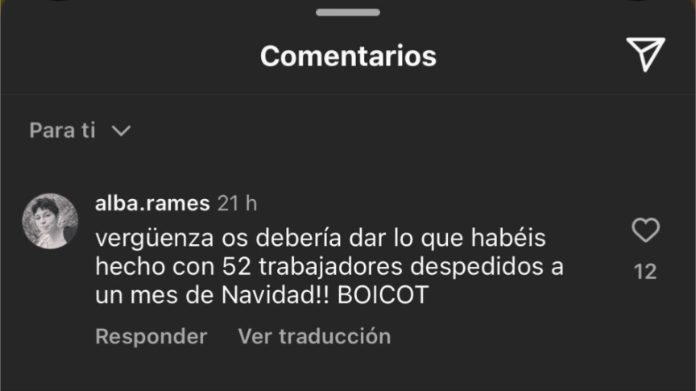

### Hablemos de la censura en las redes sociales de Freshly Cosmetics

El propósito de esta página es dar visibilidad a las voces de clientes, exclientes y personas afectadas que han expresado su opinión sobre el despido colectivo anunciado por Freshly Cosmetics. Creemos que es importante reflexionar sobre las decisiones empresariales y cómo estas impactan no solo a los trabajadores, sino también a la comunidad que ha confiado en la marca.

> vergüenza os debería dar lo que habéis hecho con 52 trabajadores despedidos a un mes de Navidad!! BOICOT!

